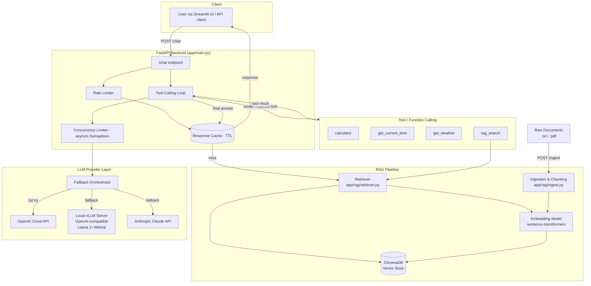
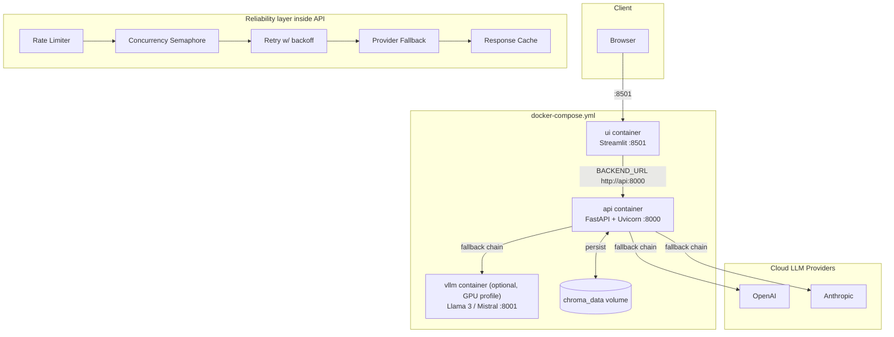

# Architecture

> Diagrams are in [Mermaid](https://mermaid.js.org/) — they render natively on
> GitHub/GitLab and in most Markdown viewers (VS Code, Obsidian, etc.).

## Task 1 — AI Assistant Core (RAG + Tools + LLM)

**Flow explanation**

1. A document is uploaded via `POST /ingest`; it's chunked (recursive
   character splitting, ~800 chars with 120-char overlap) and embedded with
   a local `sentence-transformers` model, then stored in a persistent
   ChromaDB collection.
2. A chat request first hits the rate limiter, then the cache (identical
   message + params + RAG flag returns instantly).
3. On a cache miss, the retriever embeds the query and pulls the top-k most
   similar chunks, which are injected into the system prompt as `CONTEXT`.
4. The message is sent to the **Fallback Orchestrator**, which tries
   providers in priority order (`openai → local(vLLM) → anthropic` by
   default), retrying each with exponential backoff before moving on.
5. If the model requests a tool call (calculator, weather, current time, or
   `rag_search` for an explicit knowledge-base lookup), the backend executes
   it and feeds the result back to the model — looped up to 4 times.
6. The final answer, citations, tool-call trace, and provider used are
   cached and returned as validated JSON (`ChatResponse` schema).
7. For `structured=true` requests, the model is constrained via
   OpenAI's `response_format: json_schema` (or an explicit
   schema-in-system-prompt instruction for Anthropic), and the result is
   validated against a Pydantic model with one automatic repair retry.

---

## Task 2 — Production Deployment

**Production concerns and where they're implemented**

| Concern | Implementation |
|---|---|
| Web UI | `ui/streamlit_app.py` — chat interface, RAG toggle, file upload, health check |
| Concurrency | `asyncio` throughout; `ConcurrencyLimiter` (semaphore) bounds in-flight LLM calls; `/chat/batch` runs many requests via `asyncio.gather` |
| Latency/throughput | Response cache avoids repeat LLM calls; concurrency cap prevents provider-side throttling/thrashing; vLLM (PagedAttention) for high-throughput local serving |
| Caching | `app/reliability/cache.py` — TTL + max-size cache keyed on message+params |
| Retries | `app/reliability/retry.py` — tenacity, exponential backoff + jitter, bounded attempts |
| Rate limiting | `app/reliability/rate_limiter.py` — sliding-window per-client limiter at the API edge |
| Fallback model/provider | `app/reliability/fallback.py` — ordered provider chain: cloud → local vLLM → secondary cloud |
| Graceful degradation | If *all* providers fail, the API returns a normal `200` with an explanatory message instead of a `500`/crash |
| Containerization | `Dockerfile` (API), `docker/Dockerfile.ui` (UI), `docker/Dockerfile.vllm` (local model), orchestrated by `docker-compose.yml` |
| Model optimization | See "ONNX" note in README — vLLM + PagedAttention is used instead of ONNX for the generative LLM; justification included |

### Why vLLM instead of ONNX for the generative model

ONNX Runtime is primarily built for optimizing single-batch, fixed-shape
inference for models like BERT/ResNet. Autoregressive LLM decoding has a
dynamic KV-cache and variable-length generation that ONNX's static graph
export handles poorly without heavy custom work (and typically *loses*
throughput compared to purpose-built LLM servers). vLLM's PagedAttention
gives much better real-world throughput/latency for concurrent LLM serving,
so it is used as the optimization layer for the locally-served model instead
of ONNX. ONNX conversion is still demonstrated for the embedding model,
where it's a good fit (see `README.md#optional-onnx-export-for-embeddings`).
