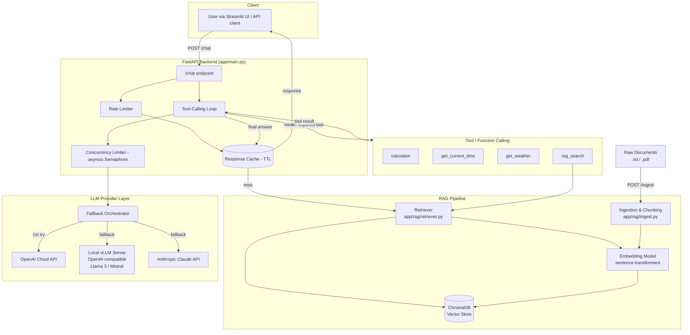
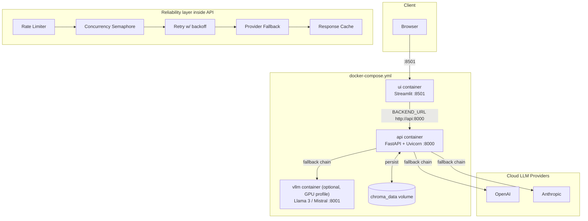
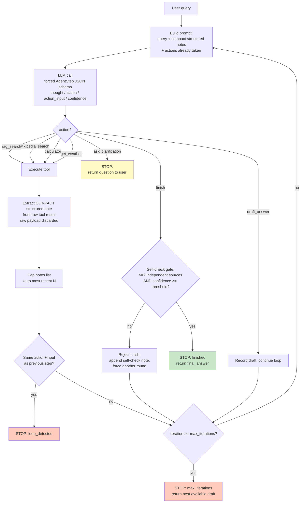

# Architecture

> Diagrams are in [Mermaid](https://mermaid.js.org/) — they render natively on
> GitHub/GitLab and in most Markdown viewers (VS Code, Obsidian, etc.).

## Task 1 — AI Assistant Core (RAG + Tools + LLM)

---

## Task 2 — Production Deployment

| Concern | Implementation |
|---|---|
| Web UI | `ui/streamlit_app.py` — chat tab + agent tab |
| Concurrency | `asyncio` throughout; `ConcurrencyLimiter` bounds in-flight LLM calls; `/chat/batch` via `asyncio.gather` |
| Caching | `app/reliability/cache.py` — TTL + max-size cache |
| Retries | `app/reliability/retry.py` — tenacity, exponential backoff + jitter |
| Rate limiting | `app/reliability/rate_limiter.py` — sliding window per client |
| Fallback provider | `app/reliability/fallback.py` — ordered chain: cloud → local vLLM → secondary cloud |
| Graceful degradation | All-providers-failed path returns `200` with an explanatory message, never a crash |
| Containerization | `Dockerfile`, `docker/Dockerfile.ui`, `docker/Dockerfile.vllm`, `docker-compose.yml` |

### Why vLLM instead of ONNX for the generative model
ONNX Runtime is built for static-shape, single-pass inference (e.g. BERT/ResNet). Autoregressive LLM decoding has a dynamic, growing KV-cache that ONNX's static graph export handles poorly. vLLM's PagedAttention gives materially better real-world throughput/latency for concurrent LLM serving, so it is used for the locally-served model instead. ONNX conversion is still demonstrated for the embedding model (`scripts/export_embedding_onnx.py`), where it's a good fit.

---

## Task 3 — Agentic Loop (VerificationAgent)

**Pattern:** single-agent loop (not multi-agent) — see README.md §Agentic Pattern for the justification. There is no coordination/hand-off structure to diagram because everything above runs inside one agent and one FastAPI request (`POST /agent/verify`); the diagram's branches are the agent's own decision points at each iteration, not separate agents.

**Context engineering, visualized above:** the `NOTE` → `CAP` step is where structured external notes are produced — this is what keeps the loop's prompt size roughly constant across iterations instead of growing with every raw tool payload (contrast with Task 1's `_run_tool_loop`, which does append full raw tool output to the message list each turn).

**Stopping conditions (loop cannot run indefinitely):** `finished` (self-check gate passed), `ask_clarification` (explicit user hand-off), `loop_detected` (identical action+input repeated), `max_iterations` (hard ceiling, `AGENT_MAX_ITERATIONS` env var, default 6), and `hard_failure` (the LLM layer itself — all providers — failed; see fallback chain in Task 2 diagram, which the agent also relies on for every LLM call).
